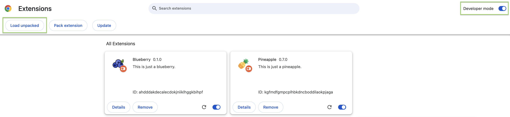

# Blueberry 🫐

[](https://twitter.com/qdqd___)

~~This is just a blueberry.~~

The blueberry is a lie. Blueberry is a browser extension that automatically redirects users from important Ethereum's explorers pages to Parsec. Are you bored with checking your transactions on Etherscan? Do you prefer to visualize addresses and blocks on Parsec? Then, this extension is for you. It is ready to use without any required configuration. Install it and enjoy Parsec.

> For the moment, this extension only works on Chromium (Chrome/Microsoft Edge/Brave...). More compatibility would coming soon.

# How to install the extension

<details>
  <summary>For developers</summary>

`npm` is required for this repository. Once `npm` is installed, run this command to install the dependencies and build the extension

```bash
npm install && npm run build:zip
```

At the root of the repository, a new directory called `build` has been created. This directory should have a file called `chrome-mv3-prod.zip`. Uncompress it because you will need it for the last step.

</details>

<details>
  <summary>For non-developers</summary>

Go to the [release page](https://github.com/qd-qd/blueberry/releases) of this repository and download the extension from the last release. Once downloaded, uncompress the file.

</details>

Now open your browser, go to the `chrome://extensions` page, enable the developer mode, click on the "Load unpacked" button and select the directory that was originally compressed.



That's it, the extension is installed and it will automatically do what it has to do without any intervention from you.

---

Blueberry icon created by [Freepik - Flaticon](https://www.flaticon.com/free-icon/blueberry_4057335)

# Explorers supported

- [x] Etherscan
- [x] Arbiscan
- [x] Optimism Etherscan
- [x] Scrollscan
- [x] Basescan
- [ ] Polygonscan
- [ ] Bscscan
